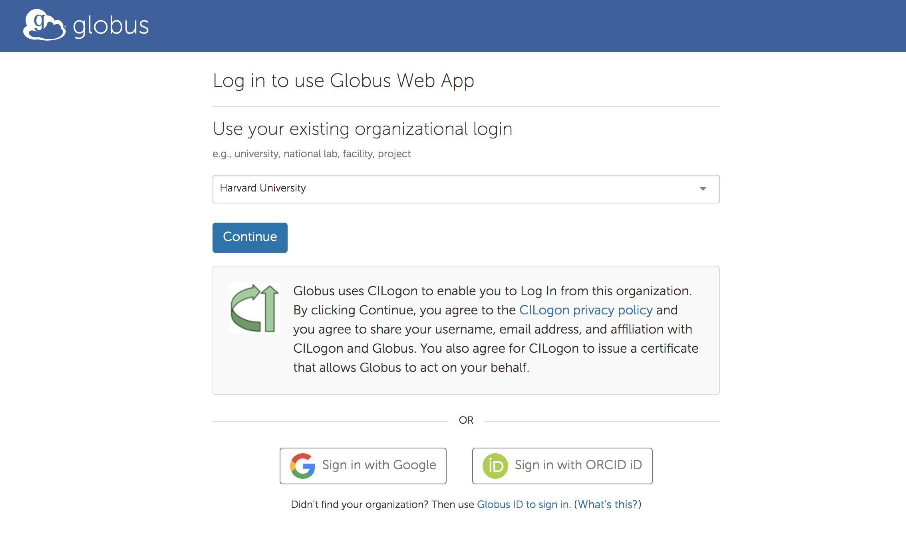
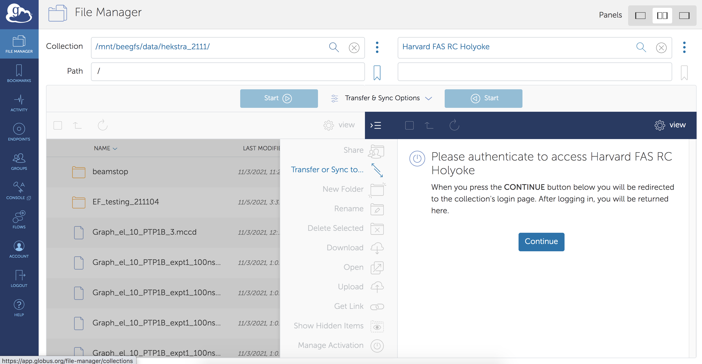
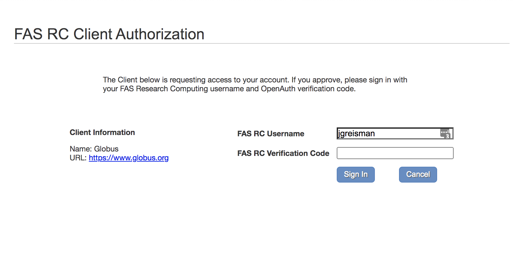
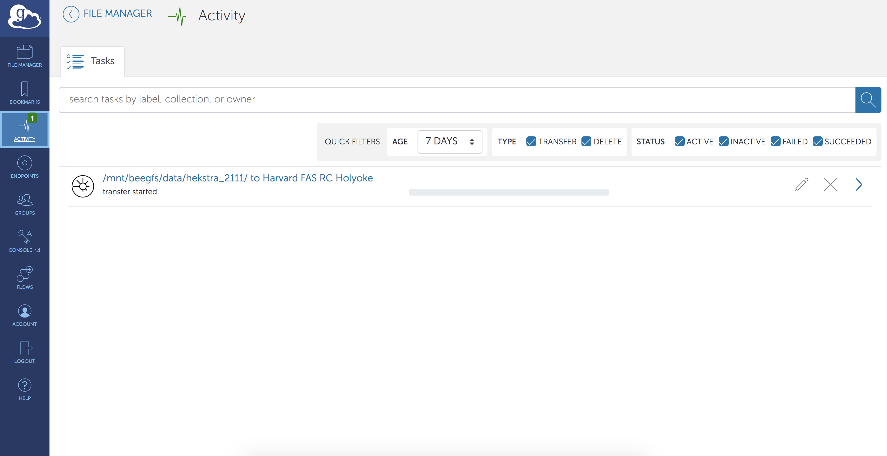

# How to Transfer Data from BioCARS to the Harvard Cluster  

This is how I have been transferring data from BioCARS to our persistent lab storage using Globus. To my knowledge, Globus is the fastest way 
to transfer data to/from the cluster. This is because the "endpoints" that are set up seem to have a rather high-speed internet connection. 
Our transfer speeds are typically ~200 MB/s. There are two steps to the process:

1. Transfer from BioCARS to `/n/holyscratch01/hekstra_lab/Lab` using Globus
2. Move/copy data from SCRATCH to persistent storage

> **_Notes for posterity:_**
> - Is it possible to transfer directly to our persistent lab storage? It does not seem to be accessible within the standard Harvard Globus endpoints.
>  May be possible to do this if we ask someone at RC -- would make the above only one step.

---
### Prerequisites

1. Harvard research computing account (Doeke can help with this)
2. Member of `hekstra_lab` Unix group (Doeke can help with this)
3. Connection to RC VPN (necessary to authenticate Harvard endpoint on Globus)

---
### Protocol with screenshots

1. Kindly ask Rob to send you a Globus link for the most recent data collection. 

> **_Pro Tip:_** This can be done *during* data collection. Globus links
   eventually time-out (couple of weeks), but this lets you move data to the cluster during collection in case you want to do any on-the-fly processing.
   
2. Follow the link in the email. 

3. Log in to Globus using your standard HarvardKey

4. Log on to Harvard RC VPN

5. Add `Harvard FAS RC Holyoke` Globus Endpoint. There is also a Boston endpoint, but the Holyoke one is necessary to transfer to `holyscratch`.
   You also need to be on the Harvard RC VPN for this to work.
   

6. Authenticate endpoint using your research computing credentials. The verification code is your standard 2FA code. 

7. Select what you want to transfer and where it should go. Oftentimes, on the BioCARS side, you just want to select all. I only subselect if we are sharing
   a beamtime with Rama's lab, and I don't want to transfer their data as well as ours. On our side, I usually make a new folder in 
   `/n/holyscratch01/hekstra_lab/Lab` or `/n/holyscratch01/hekstra_lab/Users/username`:

8. Press the start arrow that goes from BioCARS to Harvard. You should then get an entry on your "Activity" page for the transfer. 
   You will get an email when the files have transferred.

