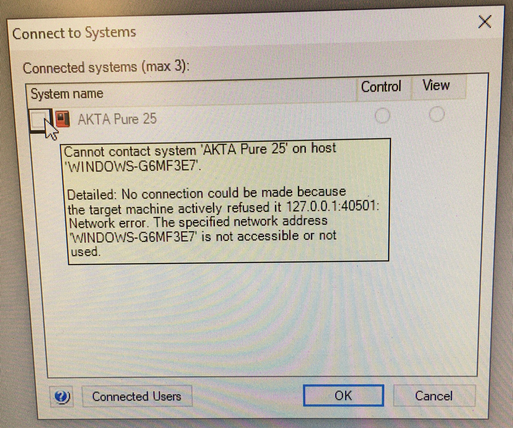

# Troubleshooting FPLC Issues

This page is intended to be the lab's collective memory of how we dealt with past FPLC issues. If you encounter and solve an issue that you think will be useful to others, please document it on this page.

### Contents:
- [UNICORN software cannot connect to AKTA](fplc.md#UNICORN-Software-Cannot-Connect-to-AKTA)

----
### UNICORN Software Cannot Connect to AKTA

After long periods without use or after Windows software updates, it is pretty common for the UNICORN software to have trouble connecting to the AKTA Pure 25. This sometimes manifests as a "grayed-out" pop-up in the main Manual Control window when trying to connect to the instrument:

When this occurs, you can occasionally fix the connection by following these steps:
1. Check that ethernet cords are connected to FPLC and lab computer
2. Switch off FPLC
3. Exit UNICORN software
4. Turn off computer
5. Restart FPLC
6. Restart computer
7. Open UNICORN software

If the above steps do not work, it is sometimes because the computer did not properly start up the `UNICORN Instrument Server`. This is what Unicorn uses to talk with the AKTA FPLC. You can manually start this server by opening Unicorn Service Tool from the Windows Start menu. Under the "Instrument Connection" panel, you can first check that the computer is registering a connection to the AKTA. You can then navigate to the "Process Status" panel and start the `UNICORN Instrument Server`. After doing this, the AKTA Pure 25 should be available in the UNICORN window for connecting. Here is what the Unicorn Service Tool looks like after manually beginning the `UNICORN Instrument Server`:

