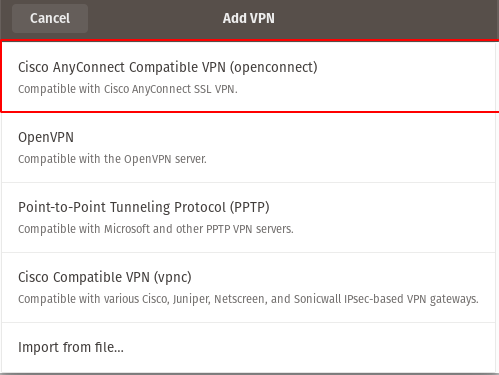
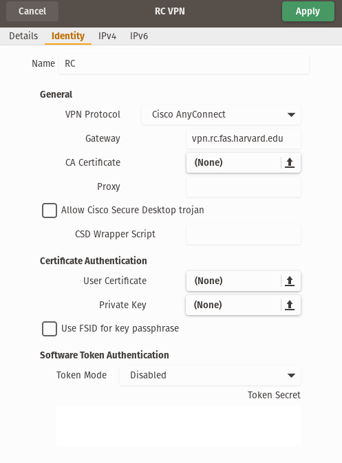
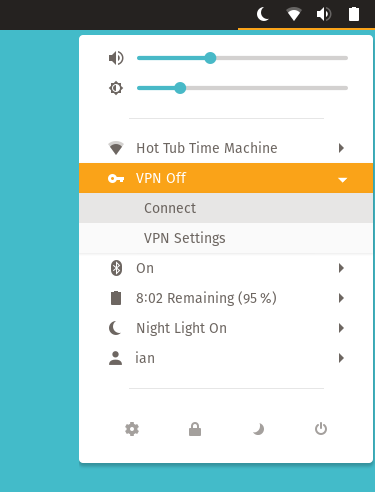

# Harvard vpn(s) without Cisco Anyconnect on linux

### Setup
You need to install the openconnect network manager to interface with the cisco vpn. Run the command:
```sudo apt install network-manager-openconnect network-manager-openconnect-gnome```
(I'm not actually sure if you need both as I installed both at once)

Go to Settings > Network and click add vpn, then select the openconnect option
 


Name the vpn whatever you want, add the gateway. The two most relevant ones are:
FAS VPN : vpn.harvard.edu
RC VPN : vpn.rc.fas.harvard.edu
 e.g. for the RC vpn:

  
 
 
 then you can access the vpn through the toolbar at the top right of the screen:
  
 
 For the RC vpn the username will be username@odyssey (e.g. ianhi@odyssey)
 and for the FAS vpn it will be the email you use for your HarvardKey login (e.g. ianhuntisaak@g.harvard.edu)
 
Then there are two passowrd fields. The first is the normal password and the second is a TOTP code. You can get this from duo by tapping on the associated account. For the RC vpn however there is a nicer way with lastpass detailed below.


### Making it nice with lastpass
If you install the lastpass command line client then you can avoid typing (or even remembering!) your passwords, and for the RC vpn you can even opening duo.

This assumes that you have the following passwords saved in your lastpass:
RC account password saved as: rc.harvard.edu
RC TOTP code as: RC TOTP Secret

You can find the TOTP secret https://software.rc.fas.harvard.edu/oa it will be under the heading "other"

install the [lastpass command line client](https://github.com/lastpass/lastpass-cli) and the openauth tool 
```sudo apt install lastpass-cli oathtool```
Then add the following lines to your `.bashrc`

```shell
lpass login [USERNAME]
export LPASS_AGENT_TIMEOUT=$((60*60*4))
alias gogopass="lpass show --password rc.harvard.edu -c; oathtool --totp -b $(lpass show --password RC\ TOTP\ Secret) | tr -d '\n' |xclip" 
alias RCcode="oathtool --totp -b $(lpass show --password RC\ TOTP\ Secret) | tr -d '\n' |xclip -selection clipboard" 
```
`gogopass` will copy the password to your clipboard and put the 2 factor authentication code as pasteable by a middle mouse click.

and `RCcode` will put the TOTP code in the clipboard.
