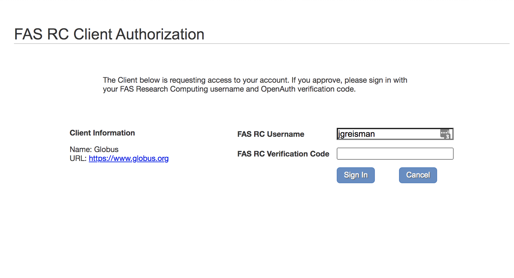

# How to Transfer Data between Tier 1 and Tier 3 Storage

This is the documentation of how to transfer data between our Tier 1 and Tier 3 storage using Globus. [Tier 1](https://docs.rc.fas.harvard.edu/kb/storage-tier-1/) is our persistent storage mounted on `/n/hekstra_lab/` and can be directly accessed from login nodes and compute nodes. [Tier 3](https://docs.rc.fas.harvard.edu/kb/storage-tier-3/) is the tape storage system which is not used in day to day research. As our lab's dataset continues to grow, we're encountering the hurdle of maxing out our Tier 1 storage capacity. In response, we've opted to purchase additional quota on the Tier 3 storage, which comes at a significantly lower cost compared to Tier 1, and migrate our archived data accordingly.

> **_Notes_**
> - At the time of writing (Apr 27, 2024), we have 32T quota on Tier 1 and 20T qupta on Tier 3. Make sure there are enough space left on the deistination sotrage before you start the transfer

---
### Reference

https://docs.rc.fas.harvard.edu/kb/tape-globus-access/

---
### Prerequisites

1. Harvard research computing account (Doeke can help with this)
2. Member of `hekstra_lab` Unix group (Doeke can help with this)
3. Connection to RC VPN (necessary to authenticate Harvard endpoint on Globus)

---
### Protocol of moving from Tier 1 to Tier 3

1. Log to the Harvard cluster via terminal, copy the data you want to archive to `/n/hekstra_lab/Lab/move_to_tier3/`. 

:warning: To move data to tape, you should make sure the data is either compressed or files are greater than 100MB before transferring any data.

> **_Pro Tip:_** Compression could take longer than you expected. Submitting a sbatch job to do it on a compute node can be a better choice.

2. Log on to Harvard RC VPN

3. Log in to [Globus](globus.org) using your standard HarvardKey

4. Add `Harvard FAS RC Holyoke` Globus endpoint, 
   
   You also need to be on the Harvard RC VPN for this to work.
   
   > **_Pro Tip:_** You can bookmark this path for future use.

5. Authenticate endpoint using your research computing credentials. The verification code is your standard 2FA code. 

6. Find the path `/n/hekstra_lab/Lab/`, this is our Tier 1 storage endpoint, you can see the `move_to_tier3` folder.

7. Open the two-panel view (right circled). On the right, open our Tier 3 endpoint `Doeke Hekstra Lab HU FASRC`:

8. Select what you want to transfer and where it should go. On the Tier 1 side, choose the file you want to transfer in the `move_to_tier3` folder. On the Tier 3 side, I have created a folder called `archive_data`, you can create your own folder if you like.

:warning: Globus is very sensitive to how the directory is specified on the Harvard cluster side -- make sure the destination directory is "checked," rather than clicking into the desired directory. Otherwise, you may run into permissions issues.

9. Press the start button on the Tier 1 side, it will start the transfer from Tier 1 to Tier 3. You should then get an entry on your "Activity" page for the transfer. 
   You will get an email when the files have transferred.

10. Once your transfer is done, remember to `rm` the compressed files in `move_to_tier3` and the origianl files before compression, to free some storage on Tier 1

---
### Protocol to moving from Tier 3 to Tier 1

1. All steps are the same as above, except two things:
   -  Make the desitnation be the `/n/hekstra_lab/Lab/move_from_tier3/` on the Tier 1 side.
   -  At the last step, you should press the start button on the Tier 3 side:

   